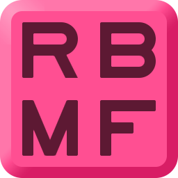
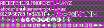
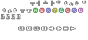

#  ReFreezed Bitmap Font converter

This command line program converts a simple custom bitmap font format to AngelCode's [BMFont](http://www.angelcode.com/products/bmfont/doc/file_format.html).
There is also some basic support for rasterizing TrueType/OpenType fonts.

The ReFreezed Bitmap Font consists of two files: an image with all the glyphs
separated by a border, and a text file (descriptor) that specifies what glyphs
are in the image (but not any coordinates, unlike BMFont).

*Who is this program for?*

If you're making bitmap fonts for your game in an image editing program but
you don't have a simple way of creating BMFont files, this program could be
what you're looking for. There are other programs that focus on rasterizing
TrueType fonts into bitmaps - this program however is focusing more on
converting a more user-friendly bitmap format to the pretty well-supported
BMFont format.

This program was made as a tool for the [LÖVE](https://love2d.org/) game
framework, but if your game engine or framework understands BMFont files
(e.g. [Unity](https://github.com/litefeel/Unity-BitmapFontImporter)
or [MonoGame](https://www.monogameextended.net/docs/features/bitmap-font/bitmap-font))
then this program may very well be useful for you.

See the [full README](https://raw.githubusercontent.com/ReFreezed/ReFreezedBitmapFontConverter/master/build/README.txt) for more info and documentation,
or download the [latest release](https://github.com/ReFreezed/ReFreezedBitmapFontConverter/releases/latest).
Also see the [examples](examples) folder.

## Example
```batch
$ RbmfConverter.exe fontSources/coolPixelFont.rbmf --outdir fonts
```

**Input image:**



**Input descriptor:**
```ini
version=1

[in]
colored=true

[out]
fileImage=<name>.png
fileDescriptor=<name>.fnt
outlineWidth=1
outlineColor=1 0 .7 .8
glyphPadding=1
custom.lineHeight=1.25

# ASCII characters
[1]
glyphs=ABCDEFGHIJKLMNOPQRSTUVWXYZ
[2]
glyphs=abcdefghijklmnopqrstuvwxyz
[3]
glyphs=0123456789
glyphs= !#$%&'()*+,-./:;<=>?@[\]^_`{|}~

# Gamepad icons
[4]
icons=hatu hatr hatd hatl
icons=axislu axislr axisld axisll axisru axisrr axisrd axisrl
icons=axisbtnl axisbtnr
[5]
icons=xboxa xboxb xboxx xboxy xboxlb xboxrb xboxlt xboxrt xboxback xboxstart
icons=pst psc psx pss psl1 psr1 psl2 psr2 psselect psstart

[kerning]
# Uppercase letters:      ABCDEFGHIJKLMNOPQRSTUVWXYZ
# Small letters:          acemnorsuvwxz
# Tall lowercase letters: bdfhiklt
# Low letters:            gpqy
# Low+tall letters:       j

# f
forward=f acdefgmnopqrsuvwxyz.,_ -1

# P
forward=P .,_ -1

# T
bothways=T acemnorsuvwxzgpqy.,_ -1
forward=Lbhkt T d -1

# Vv
bothways=Vv .,_ -1

# Other
forward=r a -1
```

**Output image:**



**Output descriptor:**
```
info face="" size=10 bold=0 italic=0 charset="" unicode=1 stretchH=100 smooth=0 aa=0 padding=1,1,1,1 spacing=0,0 outline=0 CUSTOM_lineHeight=1.2
common lineHeight=10 base=10 scaleW=150 scaleH=68 pages=1 packed=0 alphaChnl=0 redChnl=0 greenChnl=0 blueChnl=0
page id=0 file="coolPixelFont_0.png"
chars count=129
char id=36 x=0 y=0 width=7 height=12 xoffset=0 yoffset=0 xadvance=6 page=0 chnl=15
char id=47 x=7 y=0 width=6 height=12 xoffset=0 yoffset=0 xadvance=5 page=0 chnl=15
char id=92 x=13 y=0 width=6 height=12 xoffset=0 yoffset=0 xadvance=5 page=0 chnl=15
(...)
char id=95 x=25 y=62 width=6 height=3 xoffset=0 yoffset=9 xadvance=5 page=0 chnl=15
char id=46 x=31 y=62 width=3 height=3 xoffset=0 yoffset=8 xadvance=3 page=0 chnl=15
char id=32 x=0 y=0 width=0 height=0 xoffset=0 yoffset=0 xadvance=4 page=0 chnl=15
kernings count=84
kerning first=44 second=84 amount=-1
kerning first=44 second=86 amount=-1
kerning first=44 second=118 amount=-1
(...)
kerning first=120 second=84 amount=-1
kerning first=121 second=84 amount=-1
kerning first=122 second=84 amount=-1

```

Note that XML files can also be exported.
